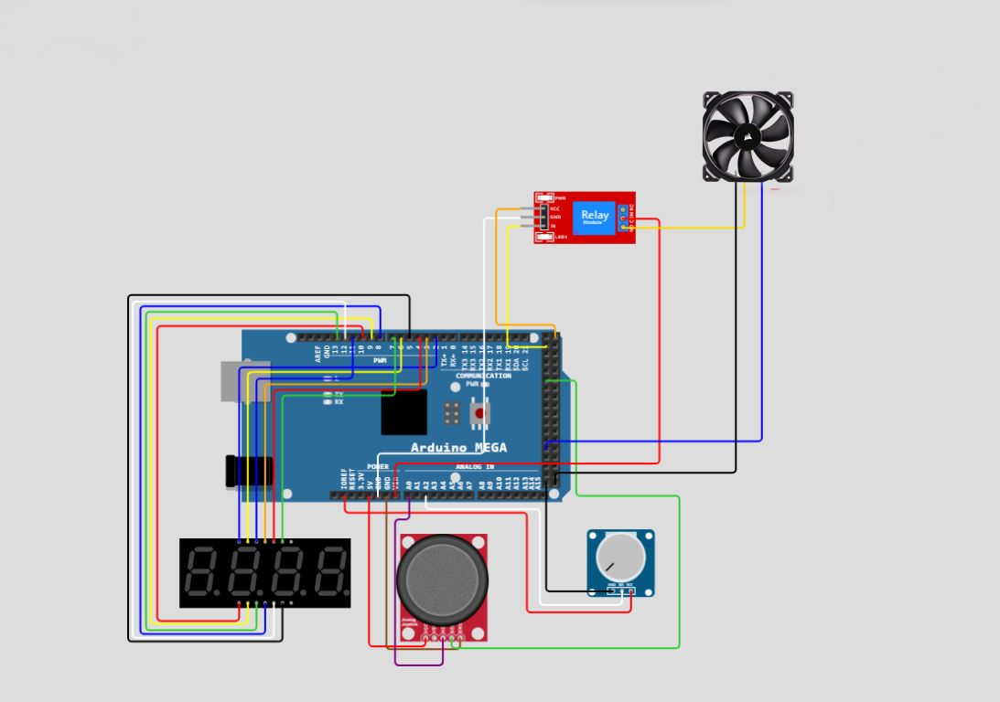
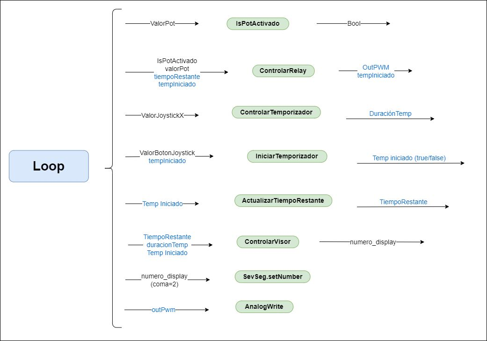

# Agitador Magnético

En este proyecto se documenta la realización de un agitador magnético sencillo de bajo costo y con **componentes reutilizados** de computadoras viejas. Incluimos los componentes y circuitos asi como del software usado para controlar, mediante una placa Arduino, la velocidad de giro de un ventilador y la actuación sobre una pantalla de 7 segmentos que muestra un temporizador.
___

# Contenidos
1. [Motivación](#Motivación)
   1. [¿Agitadores magnéticos?](##¿Agitadoresmagnéticos?)
   
2. [Nuestro Agitador](#NuestroAgitador)
   1. [Uso](#uso) 
   2. [Lista de Componentes](#lista-de-componentes)
   3. [Circuito](#circuito)
   4. [Software](#software)
3. [Inspiración](#Inpiración)

___
 
# Motivación

 Realizamos este proyecto con el fin de crear una sistema de fácil implementación para construir un agitador magnético que actualmente tienen precios altos y que sea funcional para el trabajo en el laboratorio.
 

## ¿Agitadores magnéticos?

 Los agitadores magnéticos se utilizan para la mezclar de soluciones químicas. Los agitadores comerciales consisten de una pequeña barra magnética recubierta por una capa de plástico y una placa debajo donde se encuentra un imán rotatorio a fin de crear un campo magnético que gire. Es muy frecuente que tenga un montaje de resistencias eléctricas a fin de generar calor necesario para calentar algunas soluciones químicas.

___

# Nuestro Agitador

 Para el diseño de nuestro agitador tuvimos en cuenta que debia tener la funcionalidad principal de hacer girar el buzo (para realizar el mezclado) y a su vez que tuviera un temporizador, con el cual pasado el tiempo seleccionado se apague el agitador. 

## Uso

 Girando el potenciómetro se controla la velocidad de giro del ventilador. Y mediante la utilización del Joystick (en direccion x y botón) se elige la cantidad de tiempo deseada en el temporizador. Ademas, la existencia del temporizador no implica la necesidad de utilización, sino que se puede controlar solo con el potenciometro. Sin embargo, si se utiliza el temporizador, una vez que este llega a 0, para utilizar el potenciometro se debe desconectar la alimentación y conectarla nuevamente. Otra opción es iniciar nuevamente el temporizador. 
 

## Lista de Componentes 
1. [Placa Arduino MEGA 2560](https://proyectoarduino.com/arduino-mega-2560/) .
2. Entradas: 
   1. [Potenciómetro](https://programarfacil.com/blog/arduino-blog/el-potenciometro-y-arduino/) 
   2. [Joystick](https://www.luisllamas.es/arduino-joystick/) .
3. Salidas:
   1. Ventilador con PWM [AMD AFB 3300 rpm](https://ar.mouser.com/datasheet/2/632/AFB70x70x15mm-515820.pdf) 
   2. [Pantalla 7 Segmentos](https://www.circuitbasics.com/arduino-7-segment-display-tutorial/).

4. Alimentación: 
   1. Fuente de aliemntacion 12 V [Megalite SF120050](https://megalite.com.ar/data/Catalogo_Nielsen.pdf).

5. Otros accesorios: 
   1. Cables Dupont Macho Hembra y Macho Macho de 20cm x **30**. 

## Circuito

 En cuanto al circuito, el cable de alimentación se conecta a la placa Arduino mediante la entrada de 12V. El pin Vin redirecciona la alimentación al ventilador. El controlador PWM del ventilador sale del pin 46 que tiene dicha funcionalidad. Por otro lado, la salida analogica del potenciometro se conecta al Arduino por la entrada A2 y la alimentación es de 5V que proporciona el Arduino. El modulo Relay tiene su sistema de de alimentación de 5V con los pines de la placa y el cable sensor por la salida digital 22. A traves del relay se conecta el cable Vin que conecta el ventilador. Ademas cuenta con el modulo Joystick, este se conecta a la alimentacion al igual que los anteriores. El pin digital del botón se conecta a la entrada 30 y la entrada analogica al pin A0. Todos estos componentes se conectan a los pines GND del Arduino. Finalmente el display de 7 segmentos y 4 digitos se conectan a los pines digitales desde el 1 al 13 (8 de estos por los segmentos y 4 por los digitos).  

## Software

El codigo utilizado se encuentra en el archivo [Codigo-Arduino.ino](https://github.com/manuel-penia/Proyecto-Agitador/blob/main/C%C3%B3digo-Arduino.ino)
Para simplificar la lectura y funcionamiento del codigo se realizo el siguiente diagrama explicativo. En donde, las variables azules son globales y las negras son locales. 
Para trabajar con el display se importo la libreria "SevSeg".

# Inspiración

Hay proyectos de agitadores de los cuales nos inspiramos para realizar el proyecto, algunos no utilizan una placa Arduino y ninguno posee un temporizador. 

+https://www.thingiverse.com/thing:1175415
+https://www.youtube.com/watch?v=muBcyEvqCYk&ab_channel=CambatronicsOnline
+https://forum.arduino.cc/t/controlar-ventilador-con-arduino/427074
+https://fdossena.com/?p=ArduinoFanControl/i.md
+https://www.youtube.com/watch?v=YBNEXWp-gf0
